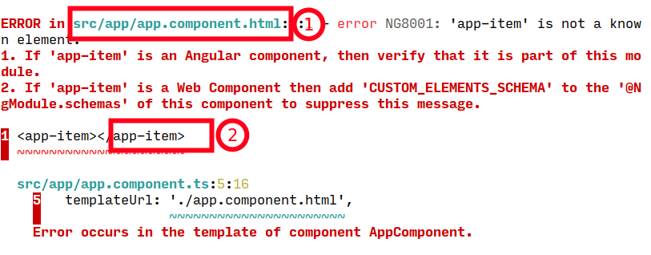

# unknown-html-schematics

This angular schematics fix - unknown HTML element or component - common angular error



## Installation

```console
npm install --save-dev unknown-html-schematics
```

## Usage

### Add selector and path from error

Check out main image.
1. it's path
2. it's selector

```console
ng g unknown-html-schematics:fix --selector app-item --path src/app/app.component.html
```

It should fix error.

## Looking for issues

This repo want to cover the most cases of `unknown HTML element or component` error please if this schematics doesn't fix your error. Please open an issue on github. 

## License

Luis Reinoso [MIT license](LICENSE)

